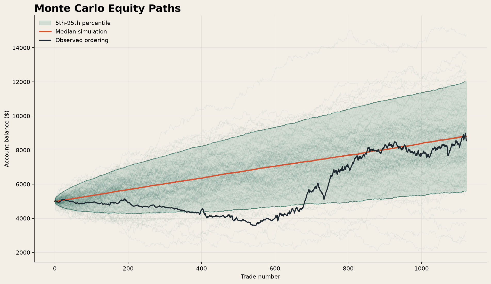

# Trading Monte Carlo Lab

A reproducible Python project for stress-testing trade-level strategy returns.
It converts one historical P&L sequence into thousands of alternative equity
paths and measures drawdown, loss, and account-survival risk.



## What this project demonstrates

- Block-bootstrap and IID-bootstrap Monte Carlo simulation
- Sequence-risk analysis through trade-order shuffling
- Probability-of-ruin and expected-shortfall estimation
- Terminal-return and maximum-drawdown distributions
- Reproducible random seeds, command-line inputs, saved outputs, and tests
- Clear separation between a trading strategy and its risk-validation layer

## Why three simulation methods?

`block-bootstrap` is the default because it resamples short, contiguous trade
sequences and retains some clustering. `iid-bootstrap` is a simpler independent
resample. `shuffle` isolates ordering risk, but every shuffled path has the same
terminal P&L because it contains the exact same set of trades. The distinction is
important when interpreting a Monte Carlo chart.

## Quick start

```bash
python3 -m venv .venv
source .venv/bin/activate
pip install -e ".[dev]"

monte-carlo-lab \
  --input sample_data/anonymized_trade_pnl.csv \
  --pnl-column pnl_points \
  --point-value 2 \
  --cost-per-trade 1.50 \
  --method block-bootstrap \
  --simulations 5000 \
  --block-size 5 \
  --initial-capital 5000 \
  --ruin-floor 1000 \
  --output-dir results
```

Run the tests with:

```bash
pytest
```

## Output

The command writes:

- `results/summary.json`: aggregate distribution and risk statistics
- `results/path_metrics.csv`: terminal balance and drawdown for every simulation
- `results/equity_paths.png`: sampled paths with 5th, 50th, and 95th percentiles

See [the methodology](docs/methodology.md) for assumptions and limitations.

## Data note

The included dataset contains only anonymized, trade-level P&L outcomes from a
personal research ledger. It excludes timestamps, market data, account details,
and strategy entry/exit rules. The sample exists to make the code reproducible;
its performance is not independently verified and is not evidence of future returns.

## Disclaimer

This repository is an educational risk-analysis project, not investment advice.
Backtests and simulations can be wrong and cannot predict future performance.
